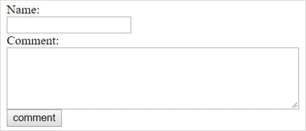

HTML Script Injection also known as Cross-Site Scripting, is a serious security threat which allows attackers to inject malicious html code in to user interfaces of a vulnerable website.

This type of injection may result in not only changing the display of the website but also it can lead to an XSS attack. XSS refers to an injection flaw whereby user input to a web script or something along such lines is placed into the output HTML, without being checked for HTML code or scripting.

Common html tags that can be prone to html script injection,

    

If another user views the comment page then the injected code will be executed which will allow the attacker to steal that user’s identity.

## How to prevent script injection attacks?

1. Disable request validation at the application level by turning off ValidateRequest in the pages element of your application's configuration file

        <configuration>
        <appSettings/>
        <connectionStrings/>
        <system.web>
        <pages validateRequest=”false”/>
        </system.web>
        </configuration>

2. Using Server.HTMLEncode() to encode the user s input

        String username= Server.HtmlEncode(TextBox1.Text);
        Response.Write(“Name: “+username);

3. Rejecting certain special characters like, “<”, “>”, “*”, “%”, “!”, “@”, etc.

4. Proper data validation

In this article we talked about what HTML Script Injection is and how to prevent it, during my previous articles we discussed on few types of code injection and this will be the last of them. Hope all that will be helpful to you in making your website secure.

I will be joining with you all with another new interesting topic soon. :)

