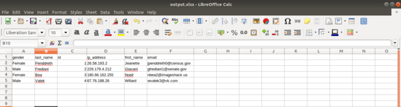
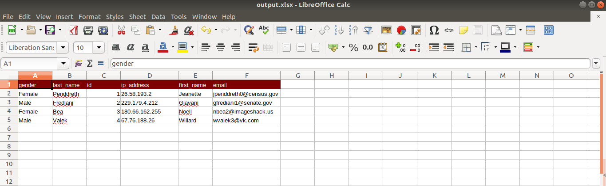

This is something I came across very recently and I thought of sharing it with all of you.

So today we are gonna learn how to create an Excel sheet and write on it using Java! So for that we are gonna use **Apache POI Library**.

**What is Apache POI?**

Apache POI is a popular API that allows programmers to create, modify, and display MS Office files using Java programs. It is an open source library developed and distributed by Apache Software Foundation to design or modify Microsoft Office files using Java program. It contains classes and methods to decode the user input data or a file into MS Office documents.

Here we are going to create a basic java program to create an excel sheet report.

First you need a set of data for the report and I'll be using the below set of data for that.

    [{
        "id": 1,
        "first_name": "Jeanette",
        "last_name": "Penddreth",
        "email": "jpenddreth0@census.gov",
        "gender": "Female",
        "ip_address": "26.58.193.2"
    }, {
        "id": 2,
        "first_name": "Giavani",
        "last_name": "Frediani",
        "email": "gfrediani1@senate.gov",
        "gender": "Male",
        "ip_address": "229.179.4.212"
    }, {
        "id": 3,
        "first_name": "Noell",
        "last_name": "Bea",
        "email": "nbea2@imageshack.us",
        "gender": "Female",
        "ip_address": "180.66.162.255"
    }, {
        "id": 4,
        "first_name": "Willard",
        "last_name": "Valek",
        "email": "wvalek3@vk.com",
        "gender": "Male",
        "ip_address": "67.76.188.26"
    }]

First we are gonna write a method for creating the report using an Array list of objects as data. Then create instances of **XSSFWorkbook** and **XSSFSheet** by importing,

`org.apache.poi.xssf.usermodel.XSSFSheet`

`org.apache.poi.xssf.usermodel.XSSFWorkbook`

    public void createWorksheet(ArrayList data) {
        XSSFWorkbook workbook = new XSSFWorkbook();
        XSSFSheet sheet = workbook.createSheet("Report");
    }

Now that we have created a sheet named Report, we need to handle data for it. Let's create a new row and write column names into that now. Here we are using the attribute names of the objects as column names so we get the first object of the array list and iterate through the keys using a String iterator as follows,

    // create header
    Row hrow = sheet.createRow(0);
    JSONObject hobj = (JSONObject) data.get(0);
    Iterator<String> hkeys = hobj.keys();
    int hcolNum = 0;
    while (hkeys.hasNext()) {
        Cell cell = hrow.createCell(hcolNum++);
        String hkey = hkeys.next();
        cell.setCellValue(hkey);
    }

Then we set the column names to the corresponding cell using a while loop. After that we move on to the data rows. We loop through the list of objects and create rows and set values for each object,

    int rowNum = 1;
    // create rows
    for (Object obj: data) {
    int colNum = 0;
    Row row = sheet.createRow(rowNum++);
    JSONObject object = (JSONObject) obj;
    Iterator<String> keys = object.keys();
    while (keys.hasNext()) {
        Cell cell = row.createCell(colNum++);
        String key = keys.next();
        if (object.get(key) instanceof String) {
        cell.setCellValue((String) object.get(key));
        } else if (object.get(key) instanceof Number) {
        cell.setCellValue((Integer) object.get(key));
        } else if (object.get(key) == null) {
        cell.setCellValue("");
        }
      }
    }

The colNum is set to zero in the beginning of the for loop and it is incremented in the while loop with every cell value we set. Well after creating the sheet we need to write this data into an excel file.

So in order to do that we need to create a FileOutputStream using java.io.FileOutputStream and write that into the workbook we created before.

    FileOutputStream outputStream = new FileOutputStream("Reports/output.xlsx");
    workbook.write(outputStream);
    workbook.close();

Here we have to create a folder named “Reports” in your project folder to save the excel sheet we will be creating. Now the main part is done and it’s time to test our program, so for that we will write a main method and get some sample data ready.

In the main method the sample data is taken as a string and then converted into an ArrayList using the method, convertToArrayList(). Then a new instance of Worksheet is created and called the method createWorksheet() using the ArrayList as an input parameter.

    public static void main (String[] args) {
    String testData = “[{\n” +
        “ \”id\”: 1,\n” +
        “ \”first_name\”: \”Jeanette\”,\n” +
        “ \”last_name\”: \”Penddreth\”,\n” +
        “ \”email\”: \”jpenddreth0@census.gov\”,\n” +
        “ \”gender\”: \”Female\”,\n” +
        “ \”ip_address\”: \”26.58.193.2\”\n” +
        “}, {\n” +
        “ \”id\”: 2,\n” +
        “ \”first_name\”: \”Giavani\”,\n” +
        “ \”last_name\”: \”Frediani\”,\n” +
        “ \”email\”: \”gfrediani1@senate.gov\”,\n” +
        “ \”gender\”: \”Male\”,\n” +
        “ \”ip_address\”: \”229.179.4.212\”\n” +
        “}, {\n” +
        “ \”id\”: 3,\n” +
        “ \”first_name\”: \”Noell\”,\n” +
        “ \”last_name\”: \”Bea\”,\n” +
        “ \”email\”: \”nbea2@imageshack.us\”,\n” +
        “ \”gender\”: \”Female\”,\n” +
        “ \”ip_address\”: \”180.66.162.255\”\n” +
        “}, {\n” +
        “ \”id\”: 4,\n” +
        “ \”first_name\”: \”Willard\”,\n” +
        “ \”last_name\”: \”Valek\”,\n” +
        “ \”email\”: \”wvalek3@vk.com\”,\n” +
        “ \”gender\”: \”Male\”,\n” +
        “ \”ip_address\”: \”67.76.188.26\”\n” +
        “}]\n” +
        “\n”;

        ArrayList output = convertToArrayList(testData);
        Worksheet wk = new Worksheet();
        wk.createWorksheet(output);
    }

Now we can run the program and check the Report Folder to find an Excel sheet created and data written on it as follows,

There are many things you can do using the Apache POI library such as formatting the excel sheet, merge cells, add custom colours etc.

For a start we can give a colour to the Column header like this,

    // Add background color to the header
    CellStyle style = workbook.createCellStyle();
    style.setFillBackgroundColor(COLOR_RED);
    style.setFillPattern(FillPatternType.BIG_SPOTS);

And for every cell value add this line,

    cell.setCellStyle(style);

Then you will get an output like this,

Here is the full implementation of our test program for your reference,

So now you know how to create an excel sheet. Visit the Apache POI library documentation and try its methods and see all the things you can do with it. Cheers!

<https://poi.apache.org/components/spreadsheet/quick-guide.html>

