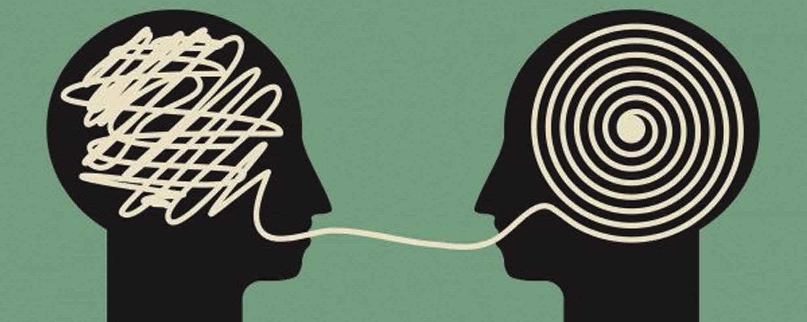

We all are dreamers. The only difference is some dream with their eyes open and some dream with closed eyes. It doesn't matter whether you dream at night in your sleep or you dream at day about your future, the mind is giving you that experience. Some say that there are no two things named mind and brain, so either mind is brain or mind can be part of the brain. And some other people argue that the mind exists independently of the brain. In this post we are not going to figure out what's the best explanation. Instead, we are going to discuss the minds ability to create realism.

Let's start with dreams since most of us have experienced it at least one time in our lives. Some dreams can be feeling so real that it made us scream at night waking the whole house. Minds can create such a real experience inside our heads. If it's the case, how can we be so sure that what we are experiencing as the reality is not a gimmick of the mind? If it can project something so real, how can we be sure about the things that we think we see from our own eyes? But we don't have much problem figuring out what's a dream and what's not. How do we have that ability? Again it's our mind that gives us the clues about what we have seen a few seconds back is its magic work. Are we controlling our minds or is it something else? If you think it's us who controls our minds then are we asking it to give some real experience to us at night? No, so there must be something else that controls at least a part of the mind.

Answer to question what controls our minds leads to more questions. What do we call we? Is it our body? Or is it only our consciousness? If it's our body, if we keep removing one body part at a time when will we lose that concept called I? If it's consciousness, Are mind and consciousness are two things or not?
Many theories try to answer these questions. In upcoming posts, we'll be discussing them one by one. Meanwhile try to find answers for them with your minds. 

